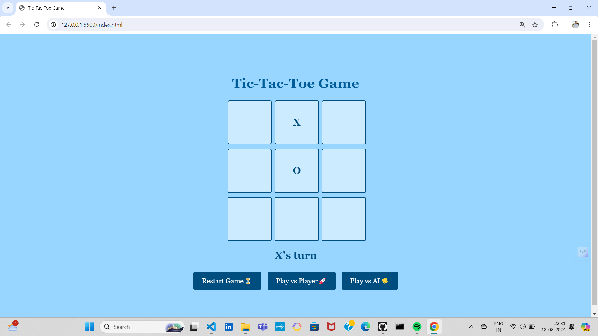

# Prodigy Infotech Internship - Task 01
Welcome to the repository showcasing the project I completed during my web development internship at Prodigy Infotech. Over the course of this internship, I honed my skills in HTML, CSS, and JavaScript by working on task. This project reflects my growth and understanding of web development fundamentals, as well as my commitment to producing clean, efficient code.

## Overview
This repository contains the Task 01 project I completed as part of my internship at Prodigy Infotech. The task involved Tic Tac Toe game.

## Project Description
This project is a fully functional Tic Tac Toe game developed as part of my internship at Prodigy Infotech. The game is built using HTML, CSS, and JavaScript, offering an engaging and interactive experience for players.

## Tic Tac Toe Game

## Key Features
1. Play vs Player: Two players can compete against each other on the same device.
2. Play vs AI: Challenge yourself against an AI opponent with smart decision-making capabilities.
3. Game Restart: Easily restart the game at any time with a click of a button to start fresh.

## Technologies Used
1. HTML
2. CSS
3. JavaScript

## How to Play
<ul>Playing Tic Tac Toe</ul>

### Game Modes:
**1. Play vs Player:** Choose this mode to play against another person.
Players take turns selecting their moves on the 3x3 grid.
**2. Play vs AI:** Choose this mode to play against the computer. 
The AI will automatically make its move after you select yours.

### Objective:
The goal is to align three of your symbols (either "X" or "O") in a row, column, or diagonal before your opponent does.

### Making a Move:
Click on any empty cell in the grid to place your symbol.
If you're playing against the AI, the computer will automatically take its turn after you.

### Winning the Game:
The game ends when one player successfully aligns three symbols in a row, column, or diagonal, or when all cells are filled without a winner (resulting in a draw).

### Restarting the Game:
Click the "Restart" button at any time to clear the grid and start a new game.
Enjoy playing Tic Tac Toe, whether you're challenging a friend or testing your skills against the AI!

**Name:** Rohit Sanap.
**Email:** rohitsanap177@gmail.com.
**LinkedIn:** www.linkedin.com/in/rohit-sanap-10989724a.